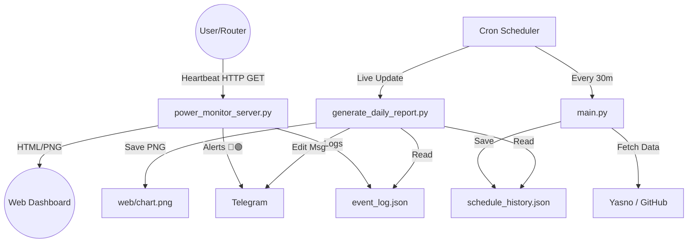
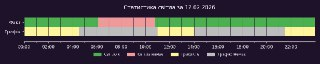
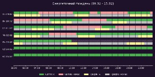

# 🇺🇦 Light Monitor Kyiv (Extended Edition)

[](https://github.com/weby-homelab/light-monitor-kyiv/actions/workflows/check_outages.yml)
[](https://github.com/weby-homelab/light-monitor-kyiv/releases)
[](https://github.com/weby-homelab/light-monitor-kyiv/stargazers)
[](https://github.com/weby-homelab/light-monitor-kyiv/discussions)
[](https://www.python.org/)
[](LICENSE)

> **Розумна система моніторингу енергопостачання, яка порівнює обіцянки енергетиків з реальністю.**

Це не просто бот, який каже "Світло є/немає". Це аналітичний інструмент для `homelab`, який збирає статистику, будує красиві графіки (Dark Mode) та вираховує, наскільки точно дотримуються графіків відключень у вашому регіоні.

---

## ✨ Ключові можливості

### 1. 🔍 Моніторинг реального стану (Power Monitor)
*   **Миттєві сповіщення:** Надсилає повідомлення `🔴 Світло зникло` та `🟢 Світло з'явилося` за секунди після події.
*   **Контекст графіків:** Бот розуміє поточний графік і коментує події:
    *   *"Світло зникло, хоча за графіком мало бути ще 30 хв"*
    *   *"Світло з'явилося раніше на 15 хв"*
*   **Статистика відключення:** При появі світла пише, скільки часу його не було.

### 2. 📊 Щоденна аналітика "План vs Факт"
Щоночі генерується графічний звіт у темній темі:
*   **Live-режим:** Бот надсилає одне повідомлення на початку доби і **оновлює** його кожні 30 хвилин. Ви завжди бачите актуальну картину без спаму новими повідомленнями.
*   **Візуалізація:** Дві часові шкали (Планова та Фактична) одна над одною.
*   **Точна статистика:** Скільки годин світла було реально, а скільки обіцяли за графіком.

### 3. 🌐 Web Dashboard (New)
Вбудований веб-інтерфейс для перегляду статусу без Telegram:
*   Доступний за адресою `http://IP:8889/`.
*   Показує великий статус (Є/Немає), таймер та актуальний графік за день.
*   Ідеально для виводу на планшет або "розумне дзеркало".

### 4. 📅 Тижневі звіти
Щотижня (у понеділок вночі) надходить великий звіт:
*   **Енергетичний "Вердикт":** Текстовий аналіз стабільності тижня (від "Спокійний" до "Важкий").
*   **Інфографіка:** Зведена діаграма за 7 днів.
*   **Рейтинг днів:** Визначення найкращого та найгіршого дня тижня.

### 5. 🤖 Автоматичне оновлення графіків
*   Скрипт постійно перевіряє API Yasno та GitHub (дані від спільноти).
*   При зміні графіку (наприклад, скасування відключень) надсилає сповіщення.

---

## 🏗 Архітектура

Система складається з незалежних модулів, що дозволяє гнучко налаштовувати її під себе.



---

## 🚀 Швидкий старт

### 1. Вимоги
*   Linux (Ubuntu/Debian/Raspbian)
*   Python 3.10+
*   "Біла" IP адреса або налаштований тунель (Cloudflare) для отримання Heartbeat-запитів.

### 2. Встановлення

```bash
# Клонування репозиторію
git clone https://github.com/weby-homelab/light-monitor-kyiv.git
cd light-monitor-kyiv

# Створення віртуального оточення
python3 -m venv venv
source venv/bin/activate

# Встановлення залежностей
pip install -r requirements.txt
```

### 3. Налаштування

Створіть файл `.env` для секретів:
```ini
TELEGRAM_BOT_TOKEN=123456:Ваш_Токен_Бота
TELEGRAM_CHANNEL_ID=-1001234567890
```

Відредагуйте `config.json` для вашої групи:
<details>
  <summary>🔍 Показати приклад config.json</summary>

```json
{
  "settings": {
    "region": "kiev",
    "groups": ["GPV36.1"],
    "show_intervals_detail": true,
    "style": "list"
  },
  "ui": {
    "icons": {
      "light_on": "🔆",
      "light_off": "✖️"
    }
  },
  "sources": {
    "yasno": { "enabled": true },
    "github": { "enabled": true }
  }
}
```
</details>

### 4. Запуск

#### Сервер моніторингу (фоновий процес)
Цей скрипт має працювати постійно. Рекомендується використовувати `systemd` або `screen/tmux`.
```bash
./venv/bin/python power_monitor_server.py
```
*Після запуску він створить файл `power_push_url.txt` з вашим унікальним посиланням для пінгів.*

#### Планувальник (Crontab)
Додайте ці рядки через `crontab -e`:

```cron
# Ранковий запуск та оновлення графіків (кожні 30 хв)
0 6 * * * /root/geminicli/light-monitor-kyiv/run_light_monitor.sh --force >> /root/geminicli/light-monitor-kyiv/cron.log 2>&1
0,30 7-23 * * * /root/geminicli/light-monitor-kyiv/run_light_monitor.sh >> /root/geminicli/light-monitor-kyiv/cron.log 2>&1

# Live-звіт (кожні 30 хв)
*/30 * * * * cd /root/geminicli/light-monitor-kyiv && ./venv/bin/python generate_daily_report.py >> /root/geminicli/light-monitor-kyiv/cron.log 2>&1

# Тижневий звіт (Понеділок 00:15)
15 0 * * 1 cd /root/geminicli/light-monitor-kyiv && export $(grep -v '^#' .env | xargs) && ./venv/bin/python generate_weekly_report.py >> cron.log 2>&1
```

---

## 📱 Приклади повідомлень

| Тип | Вигляд |
| :--- | :--- |
| **Alert** | **🟢 18:41 Світло з'явилося**<br>📊 Статистика: відключення 4 год 10 хв<br>🗓 Аналіз: За графіком НЕ мало бути до 21:00<br>• Наступне вимкнення: **23:00** |
| **Daily Report** | <br>**📈 План vs Факт:**<br>• За планом: 10 год<br>• Реально: 19.2 год<br>• Відхилення: +9.2 год (192%) |
| **Text Schedule** | **🔆 Графік групи 36.1 🔆**<br><br>📆 14.02 (Субота):<br>✖️ 19:30 - 02:00 … (6.5 год.)<br>---<br>🔆 Світло є: 10 год.<br>✖️ Світла нема: 14 год.<br>---<br>■ ■ ■ |
| **Weekly Report** | <br>🏆 **Найкращий день:** Понеділок<br>📝 **Аналіз:** Тиждень був відносно стабільним... |

---

## 🤝 Внесок у проект (Contributing)

Ми вітаємо будь-які ідеї та покращення! Ось як ви можете допомогти:

1.  Зробіть **Fork** цього репозиторію.
2.  Створіть гілку для вашої фічі (`git checkout -b feature/AmazingFeature`).
3.  Зафіксуйте зміни (`git commit -m 'Add some AmazingFeature'`).
4.  Відправте зміни у свій форк (`git push origin feature/AmazingFeature`).
5.  Відкрийте **Pull Request** у цей репозиторій.

## 📜 Ліцензія

Цей проект поширюється під ліцензією **MIT**. Дивіться файл `LICENSE` для детальної інформації.

---
*Розроблено з ❤️ у Києві під час блекаутів.*
