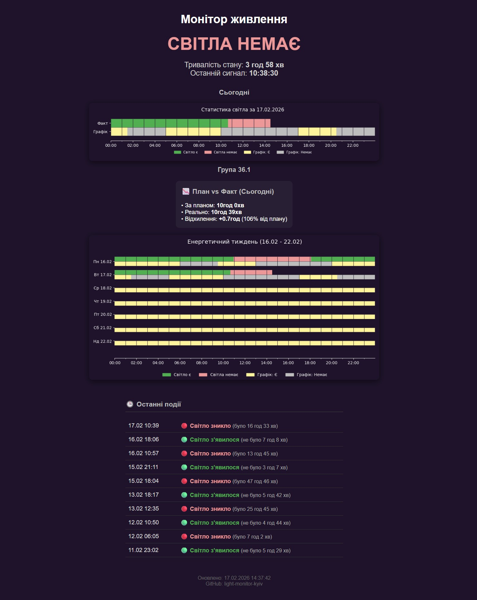
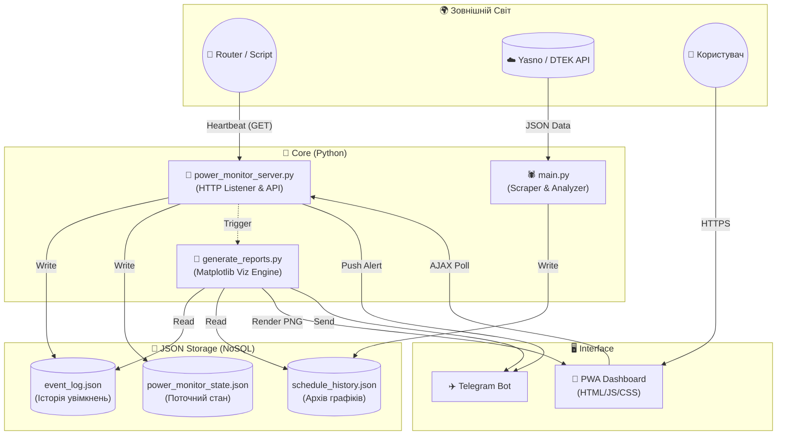

# ⚡️ Монітор електропостачання (Київ)
**Розумний енергетичний асистент для вашого дому**

[]()
[](https://www.python.org/)
[](LICENSE)
[](https://github.com/weby-homelab/light-monitor-kyiv/releases)

> **Більше ніж просто бот.** Це повноцінна аналітична система, яка моніторить реальний стан електромережі, порівнює його з графіками ДТЕК/Yasno та надає точну статистику у вигляді красивих звітів.

---

## 🌟 Основні можливості

### 🔍 Живий моніторинг (Real-time)
Миттєва реакція на зміни в мережі з інтелектуальним аналізом.
*   🚀 **Швидкість:** Сповіщення `🟢 Світло є` / `🔴 Світла немає` приходять за секунди.
*   🧠 **Контекст:** Бот знає графік. Якщо світло зникло не за планом — він про це скаже.
*   ⏱ **Точність:** "Точність: 0 хв (точно за графіком)" — для ідеальних перемикань.

### 📱 PWA Dashboard (v1.3.0)
Ваш персональний центр керування прямо в телефоні.
*   **Встановлення:** Працює як нативний додаток на iOS та Android.
*   **Офлайн-режим:** Швидке завантаження навіть при поганому інтернеті.
*   **Візуалізація:** Інтерактивні графіки, історія подій та статус в реальному часі.

### 📊 Аналітика та Звіти
Ми перетворюємо нудні дані на красиву інфографіку.
*   **Щоденний звіт:** Графік "План vs Факт". Оновлюється автоматично протягом дня.
*   **Тижневий дайджест:** Підсумки тижня, рейтинг стабільності та аналіз тенденцій.
*   **Dark Mode:** Стильний дизайн у темно-фіолетових тонах (`Deep Purple`).

---

## 📸 Галерея

| **Live Alert** | **Daily Report** | **Weekly Analysis** |
| :---: | :---: | :---: |
| *Точні сповіщення з прогнозом* | *Порівняння плану та факту* | *Глобальна статистика* |
|  |  |  |

---

## 🛠 Технологічний стек та Архітектура

Система спроектована як набір незалежних мікросервісів, що спілкуються через файлову базу даних (JSON). Це забезпечує високу відмовостійкість: якщо один модуль впаде, інші продовжать працювати.



### 🧱 Компоненти системи

*   **🐍 Core (Backend):** Python 3.10+
    *   **Async IO:** Багатопотокова обробка запитів (`threading`) для миттєвої реакції на Heartbeat.
    *   **Http.server:** Легковажний веб-сервер без важких фреймворків (Django/Flask) для максимальної швидкодії на слабкому залізі.
    *   **Subprocess:** Асинхронний запуск генераторів звітів, щоб не блокувати основний потік моніторингу.

*   **🌐 Frontend (Web & PWA):**
    *   **Vanilla JS:** Чистий JavaScript без `npm` залежностей та збірки.
    *   **PWA:** Реалізовано через `Service Workers` для офлайн-доступу та `manifest.json` для встановлення як нативний додаток.
    *   **AJAX Polling:** Живе оновлення статусу без перезавантаження сторінки.

*   **💾 Data (Persistence):**
    *   **JSON-based DB:** Використання плоских файлів замість SQL. Це дозволяє легко бекапити дані, редагувати їх вручну та не потребує налаштування сервера баз даних.
    *   **State Management:** Атомарний запис станів для запобігання колізіям.

*   **🎨 Visualization:**
    *   **Matplotlib:** Генерація растрових зображень (PNG) з кастомним `style context` для реалізації темної теми (`Deep Purple`).
    *   **Pandas-free:** Обробка часових рядів на чистому Python для економії пам'яті.

---

## 🚀 Встановлення за 5 хвилин

### 1. Підготовка
Вам знадобиться Linux-сервер (VPS, Raspberry Pi, або старий ноутбук з Ubuntu).

```bash
# Клонування репозиторію
git clone https://github.com/weby-homelab/light-monitor-kyiv.git
cd light-monitor-kyiv

# Налаштування середовища
python3 -m venv venv
source venv/bin/activate
pip install -r requirements.txt
```

### 2. Конфігурація
Створіть файл `.env`:
```ini
TELEGRAM_BOT_TOKEN=ваш_токен
TELEGRAM_CHANNEL_ID=айді_каналу
```

### 3. Запуск
Запустіть сервер моніторингу та додайте завдання в Cron для автоматизації (див. файл `INSTRUCTIONS.md` для деталей).

---

## 🆕 Останні оновлення

### v1.3.0 — Precision Update & PWA
*   📱 **PWA Support:** Перетворення веб-панелі на мобільний додаток.
*   🎯 **Хірургічна точність:** Нова логіка визначення відхилень від графіку.
*   🔮 **Розумний прогноз:** Відображення повного діапазону наступного відключення.

### v1.2.0 — Energy Control Center
*   🌐 **Web Dashboard 2.0:** Новий дизайн, історія подій, покращена продуктивність.

---

## 🤝 Контриб'ютинг
Цей проект — Open Source. Ми вітаємо будь-які ідеї, виправлення помилок та нові функції.
*   Знайшли баг? Відкрийте **Issue**.
*   Хочете додати фічу? Надсилайте **Pull Request**.

---
*Розроблено з ❤️ та 🔦 у Києві.*
