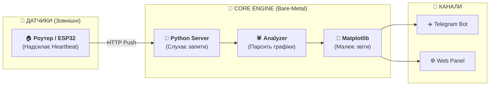

<p align="center">
  <a href="README_ENG.md">
    
  </a>
  <a href="README.md">
    
  </a>
</p>

<br>

# 📊 Light Monitor Kyiv (v1.2.1)
**Інтелектуальна аналітика електромережі для вашої HomeLab.**

[]()
[](https://www.python.org/)
[](https://ubuntu.com/)

---

## 🔍 Про проект

**Light Monitor Kyiv** — це спеціалізований інструмент для глибокого аналізу стабільності електромережі. На відміну від простих сповіщувачів, ця система фокусується на порівнянні реальної ситуації з офіційними графіками та генерує детальну інфографіку.

Проект ідеально підходить для розгортання на слабкому залізі (Raspberry Pi, старі ноутбуки, VPS), оскільки написаний на чистому Python без важких залежностей.

---

## 🚀 Ключові можливості

- **📊 Аналітика «План vs Факт»:** Автоматичне виявлення відхилень від офіційних графіків ДТЕК/Yasno.
- **⏱️ Хірургічна точність:** Фіксація подій з точністю до секунд та розрахунок часу «запізнення» або «раннього ввімкнення».
- **📈 Візуалізація:** Генерація денних та тижневих звітів у Dark Mode для Telegram та Web.
- **📱 Web Dashboard:** Легка веб-панель для моніторингу статусу в реальному часі.

---

## 🏗 Як це працює

Система складається з сервера (цей проект) та зовнішніх датчиків.



*Примітка: Роутер або IoT-пристрій налаштовується на надсилання звичайного HTTP-запиту на сервер, коли з'являється живлення.*

---

## 📦 Встановлення (Bare-Metal)

Проект розрахований на пряме встановлення в ОС (Ubuntu/Debian).

### 1. Підготовка
```bash
git clone https://github.com/weby-homelab/light-monitor-kyiv.git
cd light-monitor-kyiv
python3 -m venv venv
source venv/bin/activate
pip install -r requirements.txt
```

### 2. Конфігурація
Налаштуйте `.env` файл (токен бота та ID каналу) та `config.json` (ваша група вимкнень).

### 3. Автоматизація
Для стабільної роботи налаштуйте системний сервіс (файл `power_monitor.service`) та додайте завдання в Cron для регулярного оновлення графіків (див. `INSTRUCTIONS.md`).

---

## 📜 Ліцензія
Розповсюджується під ліцензією **MIT**.

<p align="center">
  © 2026 Weby Homelab<br>
  Built to survive 12h+ blackouts & grid attacks since 2022
</p>
