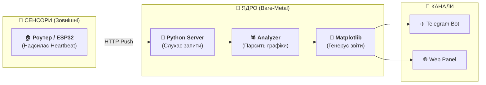

<p align="center">
  <a href="README_ENG.md">
    
  </a>
  <a href="README.md">
    
  </a>
</p>

<br>

# 📊 Light Monitor Kyiv (v1.2.1)
**Інтелектуальна аналітика електромережі для вашої HomeLab.**

> [!IMPORTANT]
> **СТАТУС ПРОЕКТУ:** Активну роботу цього проекту на бойовому сервері **ЗУПИНЕНО**. Весь функціонал перенесено та вдосконалено в межах нового проекту [flash-monitor-kyiv](https://github.com/weby-homelab/flash-monitor-kyiv). Код залишається повністю відкритим — ви можете вільно завантажувати, форкати та використовувати його у своїх цілях.

[](https://www.python.org/)
[](https://ubuntu.com/)

---

## 🔍 Огляд

**Light Monitor Kyiv** — це спеціалізований інструмент для глибокого аналізу стабільності електромережі. На відміну від простих сповіщувачів, ця система зосереджена на порівнянні реальних подій з офіційними графіками та генерації детальної інфографіки.

Проект ідеально підходить для розгортання на малопотужному обладнанні (Raspberry Pi, старі ноутбуки, VPS), оскільки написаний на чистому Python з мінімальними залежностями.

---

## 🚀 Основні можливості

- **📊 Аналітика «План vs Факт»:** Автоматичне виявлення відхилень від офіційних графіків ДТЕК/Yasno.
- **⏱️ Хірургічна точність:** Фіксація подій з точністю до секунди та розрахунок часу «запізнення» або «раннього ввімкнення».
- **📈 Візуалізація:** Генерація денних та тижневих звітів у Dark Mode для Telegram та Web.
- **📱 Web Dashboard:** Легка веб-панель для моніторингу статусу в реальному часі.

---

## 🏗 Як це працює

Система складається із сервера (цей проект) та зовнішніх сенсорів.



*Примітка: Ваш роутер або IoT-пристрій має бути налаштований на надсилання простого HTTP-запиту до сервера щоразу, коли з'являється живлення.*

---

## 📦 Встановлення (Bare-Metal)

Проект розроблений для прямого встановлення на Linux (Ubuntu/Debian).

### 1. Налаштування
```bash
git clone https://github.com/weby-homelab/light-monitor-kyiv.git
cd light-monitor-kyiv
python3 -m venv venv
source venv/bin/activate
pip install -r requirements.txt
```

### 2. Конфігурація
Налаштуйте файл `.env` (токен бота та ID каналу) та `config.json` (ваша група відключень).

### 3. Автоматизація
Для стабільної роботи налаштуйте системний сервіс (`power_monitor.service`) та додайте завдання Cron для регулярного оновлення графіків (див. `INSTRUCTIONS.md`).

---

## 📜 Ліцензія
Розповсюджується за ліцензією **MIT**.

<p align="center">
  © 2026 Weby Homelab — інфраструктура, яка не здається.<br>
  Зроблено з ❤️ у Києві під звуки сирен та блекаутів...
</p>
