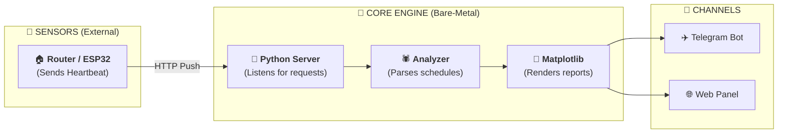

<p align="center">
  <a href="README_ENG.md">
    
  </a>
  <a href="README.md">
    
  </a>
</p>

<br>

# 📊 Light Monitor Kyiv (v1.2.1)
**Intelligent power grid analytics for your HomeLab.**

[]()
[](https://www.python.org/)
[](https://ubuntu.com/)

---

## 🔍 Overview

**Light Monitor Kyiv** is a specialized tool for deep analysis of power grid stability. Unlike simple notifiers, this system focuses on comparing real-world events with official schedules and generating detailed infographics.

The project is ideal for deployment on low-power hardware (Raspberry Pi, old laptops, VPS) as it is written in pure Python with minimal dependencies.

---

## 🚀 Key Features

- **📊 "Plan vs Fact" Analytics:** Automatic detection of deviations from official DTEK/Yasno schedules.
- **⏱️ Surgical Precision:** Recording events with second-level accuracy and calculating "delay" or "early restoration" times.
- **📈 Visualization:** Generation of daily and weekly reports in Dark Mode for Telegram and Web.
- **📱 Web Dashboard:** A lightweight web panel for real-time status monitoring.

---

## 🏗 How It Works

The system consists of a server (this project) and external sensors.



*Note: Your router or IoT device should be configured to send a simple HTTP request to the server whenever power is available.*

---

## 📦 Installation (Bare-Metal)

This project is designed for direct installation on Linux (Ubuntu/Debian).

### 1. Setup
```bash
git clone https://github.com/weby-homelab/light-monitor-kyiv.git
cd light-monitor-kyiv
python3 -m venv venv
source venv/bin/activate
pip install -r requirements.txt
```

### 2. Configuration
Configure your `.env` file (bot token and channel ID) and `config.json` (your power outage group).

### 3. Automation
For stable operation, set up the system service (`power_monitor.service`) and add Cron tasks for regular chart updates (see `INSTRUCTIONS.md`).

---

## 📜 License
Distributed under the **MIT** License.

<p align="center">
  © 2026 Weby Homelab — infrastructure that doesn’t give up.<br>
  Made with ❤️ in Kyiv under air raid sirens and blackouts...
</p>
