# ⚡️ Power Monitor (Kyiv)
**Smart energy assistant for your home**

[]()
[](https://www.python.org/)
[](LICENSE)
[](https://github.com/weby-homelab/light-monitor-kyiv/releases)

> **More than just a bot.** It is a comprehensive analytical system that monitors the real state of the power grid, compares it with official DTEK/Yasno schedules, and provides accurate statistics via beautiful reports.

---

## 🌟 Key Features

### 🔍 Real-time Monitoring
Instant reaction to grid changes with intelligent analysis.
*   🚀 **Speed:** `🟢 Power is ON` / `🔴 Power is OFF` notifications arrive in seconds.
*   🧠 **Context:** The bot knows the schedule. If power goes down unexpectedly, it will highlight the discrepancy.
*   ⏱ **Accuracy:** "Accuracy: 0 min (exactly on schedule)" — for perfect grid switching.

### 📱 PWA Dashboard (v1.3.0)
Your personal control center right on your phone.
*   **Installation:** Works as a native app on iOS and Android.
*   **Offline Mode:** Fast loading even with poor internet connection.
*   **Visualization:** Interactive charts, event history, and real-time status.

### 📊 Analytics & Reports
Turning boring data into beautiful infographics.
*   **Daily Report:** "Plan vs Fact" chart. Updates automatically throughout the day.
*   **Weekly Digest:** Weekly summaries, stability ratings, and trend analysis.
*   **Dark Mode:** Stylish design in `Deep Purple` tones.

---

## 📸 Gallery

| **Live Alert** | **Daily Report** | **Weekly Analysis** |
| :---: | :---: | :---: |
| *Accurate alerts with forecasts* | *Comparison of plan and fact* | *Global statistics* |
|  |  |  |

---

## 🛠 Tech Stack & Architecture

The system is designed as a set of independent microservices communicating through a file-based database (JSON). This ensures high resilience: if one module fails, others continue to work.

```mermaid
graph TD
    subgraph External["🌍 External World"]
        Router(("📡 Router / Script"))
        Yasno[("☁️ Yasno / DTEK API")]
        User(("👤 User"))
    end

    subgraph Backend["🧠 Core (Python)"]
        Monitor["🚀 power_monitor_server.py<br>(HTTP Listener & API)"]
        Scraper["🕷️ main.py<br>(Scraper & Analyzer)"]
        Generator["🎨 generate_reports.py<br>(Matplotlib Viz Engine)"]
    end

    subgraph Database["💾 JSON Storage (NoSQL)"]
        EventLog[("event_log.json<br>(Switch history)")]
        SchedLog[("schedule_history.json<br>(Schedule archive)")]
        State[("power_monitor_state.json<br>(Current status)")]
    end

    subgraph Frontend["🖥️ Interface"]
        TG["✈️ Telegram Bot"]
        PWA["📱 PWA Dashboard<br>(HTML/JS/CSS)"]
    end

    %% Data Flow
    Router -- "Heartbeat (GET)" --> Monitor
    Yasno -- "JSON Data" --> Scraper
    
    %% Logic
    Monitor -- "Write" --> EventLog & State
    Scraper -- "Write" --> SchedLog
    Monitor -.-> |"Trigger"| Generator
    
    %% Visualization
    Generator -- "Read" --> EventLog & SchedLog
    Generator -- "Render PNG" --> PWA
    Generator -- "Send" --> TG
    
    %% User Interaction
    Monitor -- "Push Alert" --> TG
    User -- "HTTPS" --> PWA
    PWA -- "AJAX Poll" --> Monitor
```



### 🧱 System Components

*   **🐍 Core (Backend):** Python 3.10+
    *   **Async IO:** Multi-threaded request processing (`threading`) for instant Heartbeat response.
    *   **Http.server:** Lightweight web server without heavy frameworks (Django/Flask) for maximum performance on weak hardware.
    *   **Subprocess:** Asynchronous launch of report generators to avoid blocking the main monitoring thread.

*   **🌐 Frontend (Web & PWA):**
    *   **Vanilla JS:** Pure JavaScript without `npm` dependencies or builds.
    *   **PWA:** Implemented via `Service Workers` for offline access and `manifest.json` for installation as a native app.
    *   **AJAX Polling:** Live status updates without page reloads.

*   **💾 Data (Persistence):**
    *   **JSON-based DB:** Using flat files instead of SQL. This allows for easy backups, manual editing, and requires no database server setup.
    *   **State Management:** Atomic state writing to prevent collisions.

*   **🎨 Visualization:**
    *   **Matplotlib:** Generating raster images (PNG) with a custom `style context` for the `Deep Purple` dark theme.
    *   **Pandas-free:** Time series processing in pure Python to save memory.

---

## 🚀 5-Minute Installation

### 1. Preparation
You will need a Linux server (VPS, Raspberry Pi, or an old laptop with Ubuntu).

```bash
# Clone repository
git clone https://github.com/weby-homelab/light-monitor-kyiv.git
cd light-monitor-kyiv

# Environment setup
python3 -m venv venv
source venv/bin/activate
pip install -r requirements.txt
```

### 2. Configuration
Create a `.env` file:
```ini
TELEGRAM_BOT_TOKEN=your_token
TELEGRAM_CHANNEL_ID=your_channel_id
```

### 3. Launch
Start the monitoring server and add a task to Cron for automation (see `INSTRUCTIONS.md` for details).

---

## 🆕 Recent Updates

### v1.3.0 — Precision Update & PWA
*   📱 **PWA Support:** Turning the web panel into a mobile app.
*   🎯 **Surgical Precision:** New logic for detecting schedule deviations.
*   🔮 **Smart Forecast:** Displaying the full range of the next outage.

### v1.2.0 — Energy Control Center
*   🌐 **Web Dashboard 2.0:** New design, event history, improved performance.

---

## 🤝 Contributing
This project is Open Source. We welcome any ideas, bug fixes, and new features.
*   Found a bug? Open an **Issue**.
*   Want to add a feature? Send a **Pull Request**.

---
*Developed with ❤️ and 🔦 in Kyiv.*
